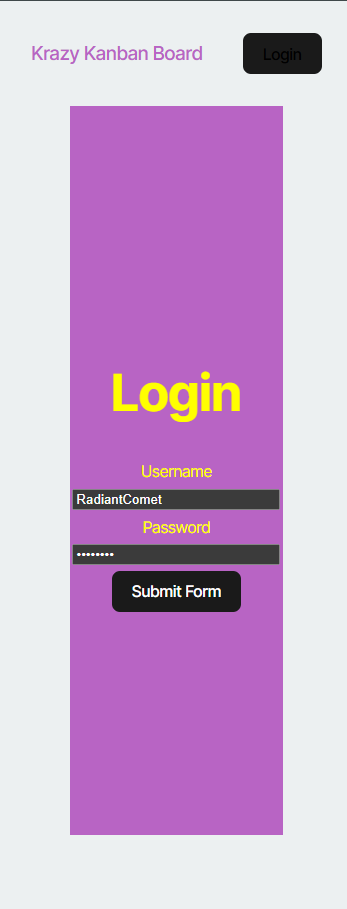

# Challenge-14-Kanban-Board

## Description
This is an interactive Kanban board deployed on Render. 

## Table of Contents
- [Installation](#installation)
- [Usage](#usage)
- [License](#license)
- [Contributing](#contributing)
- [Tests](#tests)
- [Questions](#questions)

## Installation
Clone the repository & run npm install followed by npm start to begin the development server. This project utilizes SQL databases for the login information, so running the schema & seeds files are necessary for appropriate functionality. 

## Usage
This is a kanban board that can be used to track the progress of work. Users can add & delete issues, change ticket status, and assign tickets to different individuals. 

## License
This project is licensed under the [MIT]([License](https://opensource.org/licenses/MIT)) license.

## Contributing
I am the sole contributor to this project. If you would like to add to the project please reach out. 

## Tests
Download the necessary packages and ensure that the Kanban board runs in browser. 

## Questions
If you have any questions, please contact me at [nataliegindraux@gmail.com](mailto:nataliegindraux@gmail.com) or find me on GitHub [ngin2894](https://github.com/ngin2894).